<h1 align="center">
   
  Bluversation
</h1>

  <strong>A bluetooth chat</strong> 
  A simple bluetooth chat iOS and macOS application

- [Use Cases](#use-cases)
- [Technologies](#technologies)
- [Diagrams](#diagrams)
  - [Project structure](#project-structure)
  - [Group `view` and `viewmodel`](#group-view-and-viewmodel)
  - [Group `view.viewdata`](#group-viewviewdata)
  - [Group `viewmodel` and `view.viewdata`](#group-viewmodel-and-viewviewdata)
  - [Group `viewmodel` and `model.repository`](#group-viewmodel-and-modelrepository)
  - [Group `model`](#group-model)
  - [Group `model.repository` and `model`](#group-modelrepository-and-model)
- [Future Tasks](#future-tasks)

## Use Cases
<table>
  <thead>
    <tr>
      <th>&nbsp;&nbsp;&nbsp;&nbsp;&nbsp;&nbsp;&nbsp;&nbsp;&nbsp;&nbsp;&nbsp;&nbsp;&nbsp;&nbsp;&nbsp;&nbsp;&nbsp;&nbsp;&nbsp;&nbsp;&nbsp;&nbsp;&nbsp;&nbsp;&nbsp;&nbsp;&nbsp;&nbsp;&nbsp;&nbsp;&nbsp;&nbsp;&nbsp;&nbsp;&nbsp;&nbsp;&nbsp;&nbsp;&nbsp;&nbsp;&nbsp;&nbsp;&nbsp;&nbsp;&nbsp;&nbsp;&nbsp;&nbsp;&nbsp;&nbsp;&nbsp;&nbsp;&nbsp;&nbsp;&nbsp;&nbsp;&nbsp;&nbsp;&nbsp;&nbsp;</th>
      <th>&nbsp;&nbsp;&nbsp;&nbsp;&nbsp;&nbsp;&nbsp;&nbsp;&nbsp;&nbsp;&nbsp;&nbsp;&nbsp;&nbsp;&nbsp;&nbsp;&nbsp;&nbsp;&nbsp;&nbsp;&nbsp;&nbsp;&nbsp;&nbsp;&nbsp;&nbsp;&nbsp;&nbsp;&nbsp;&nbsp;&nbsp;&nbsp;&nbsp;&nbsp;&nbsp;&nbsp;&nbsp;&nbsp;&nbsp;&nbsp;&nbsp;&nbsp;&nbsp;&nbsp;&nbsp;&nbsp;&nbsp;&nbsp;&nbsp;&nbsp;&nbsp;&nbsp;&nbsp;&nbsp;&nbsp;&nbsp;&nbsp;&nbsp;&nbsp;&nbsp;&nbsp;&nbsp;&nbsp;&nbsp;&nbsp;&nbsp;&nbsp;&nbsp;&nbsp;&nbsp;&nbsp;&nbsp;&nbsp;&nbsp;&nbsp;&nbsp;&nbsp;&nbsp;&nbsp;&nbsp;&nbsp;&nbsp;&nbsp;&nbsp;&nbsp;&nbsp;&nbsp;&nbsp;&nbsp;&nbsp;&nbsp;&nbsp;&nbsp;&nbsp;&nbsp;&nbsp;&nbsp;&nbsp;&nbsp;&nbsp;&nbsp;&nbsp;&nbsp;&nbsp;&nbsp;&nbsp;&nbsp;&nbsp;&nbsp;&nbsp;&nbsp;&nbsp;&nbsp;&nbsp;&nbsp;&nbsp;&nbsp;&nbsp;&nbsp;&nbsp;&nbsp;&nbsp;&nbsp;&nbsp;&nbsp;&nbsp;&nbsp;&nbsp;&nbsp;&nbsp;</th>
    </tr>
  </thead>
  <tbody>
    <tr>
      <td>
        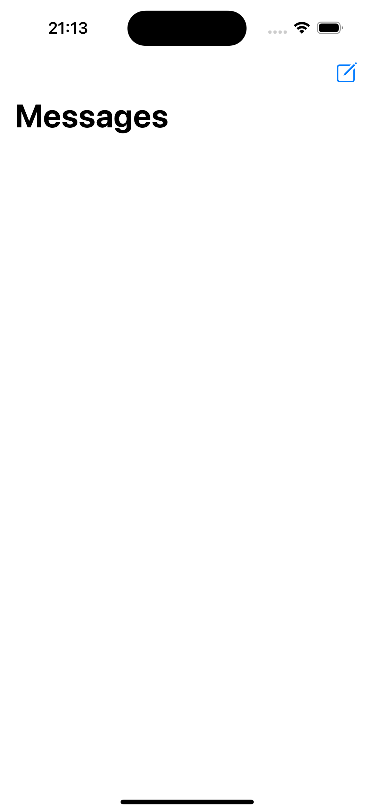
      </td>
      <td>
        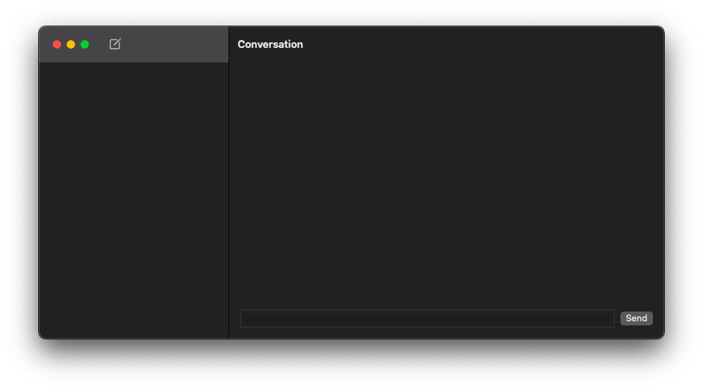
      </td>
    </tr>
    <tr>
      <td colspan="2">
        This is the app when you open it for the first time. To start a conversation, click on the icon at the top to find the contacts. You'll need to turn Bluetooth on in order to find and chat with other contacts.
      </td>
    </tr>
    <tr>
      <td>
        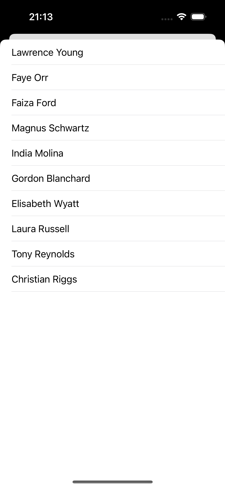
      </td>
      <td>
        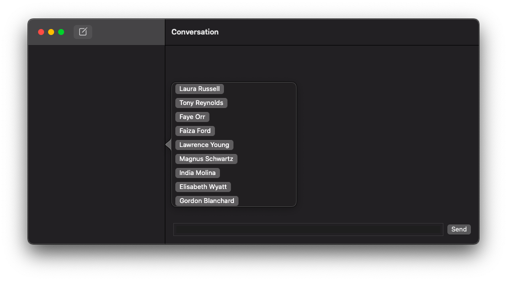
      </td>
    </tr>
    <tr>
      <td colspan="2">
        Here is the contacts dialog opened. Select one of the contacts found to start a conversation.
      </td>
    </tr>
    <tr>
      <td>
        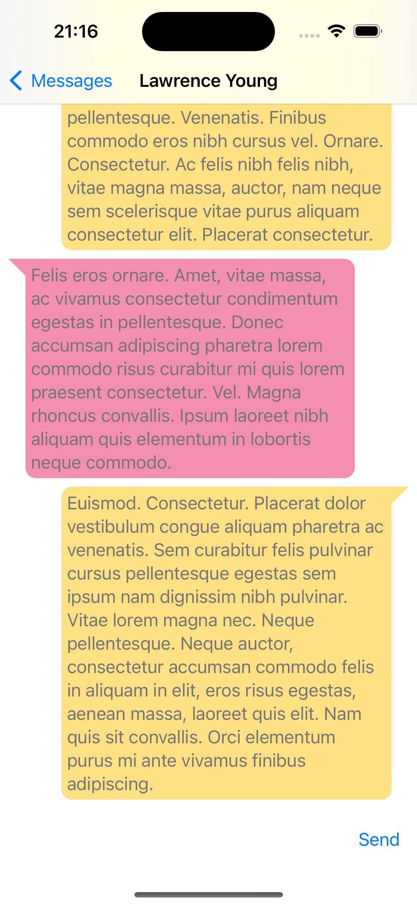
      </td>
      <td>
        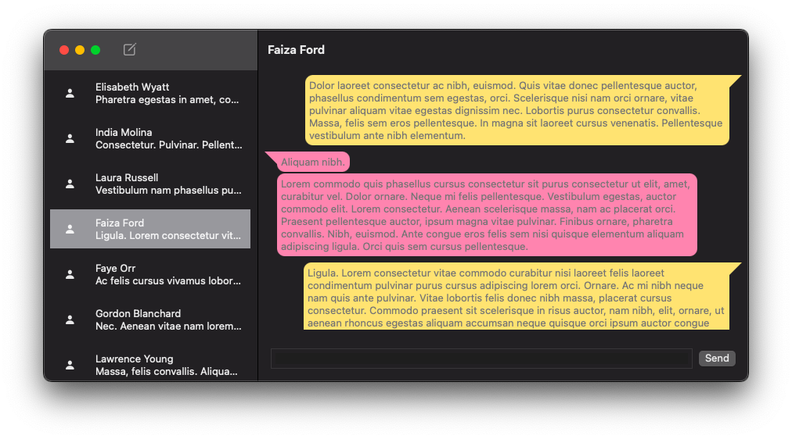
      </td>
    </tr>
    <tr>
      <td colspan="2">
        This is how the conversation will appear with a complete chat history. Type your message in the text field at the bottom of the screen to send messages.
      </td>
    </tr>
  </tbody>
</table>

# Technologies
|Technology|Purpose|
|:-:|:-:|
| [SwiftUI](https://developer.apple.com/xcode/swiftui/)|Design UI|  
| [Bluetooth](https://developer.apple.com/xcode/swiftui/)|Communication between the devices|  

## Diagrams
  Please check <a href="https://github.com/giovanischiar/diagram-notation">this repository</a> to learn more about the notation I used to create the diagrams in this project.

### Project structure
  This diagram shows all the groups the application has, along with their structures. Some groups are simplified, while others are more detailed.

<picture>
  <source media="(prefers-color-scheme: dark)" srcset="./readme-res/diagrams/dark/project-structure-diagram.dark.svg">
  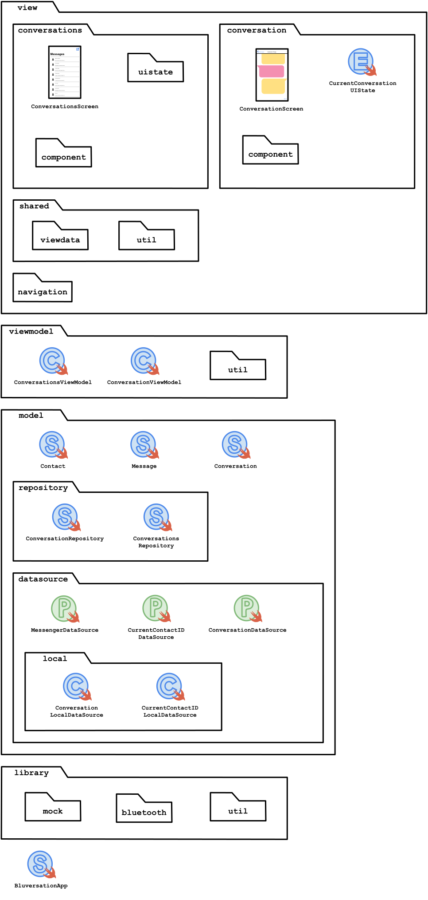
</picture>

### Group `view` and `viewmodel`
  These diagrams illustrate the relationship between screens from `view` and `viewmodel` classes. The arrows from the View Models represent View Data objects (structs that hold all the necessary data for the view to display), primitives, or collections encapsulated by [Publishers](https://developer.apple.com/documentation/combine/publisher), which are artifacts that encapsulate data streams. Every update in the View Data triggers the Publisher to emit these new values to the `view`, and the view updates automatically. Typically, the methods called from screens in `view` to classes in `viewmodel` trigger these changes, as represented in the diagram below by arrows from the `view` screens to `viewmodel` classes.

<picture>
  <source media="(prefers-color-scheme: dark)" srcset="./readme-res/diagrams/dark/view-view-model-diagram.dark.svg">
  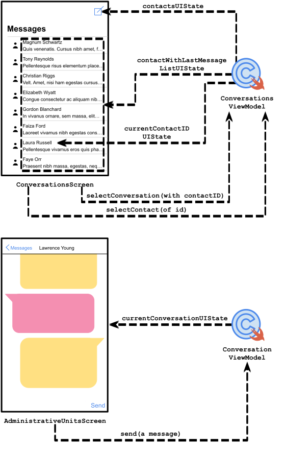
</picture>

### Group `view.viewdata`
  View Datas are structs that hold all the data the `view` needs to present. They are created from `model` structs and served by View Models to the `view`. This diagram represents all the associations among the artifacts in the `view.viewdata`.

<picture>
  <source media="(prefers-color-scheme: dark)" srcset="./readme-res/diagrams/dark/viewdata-diagram.dark.svg">
  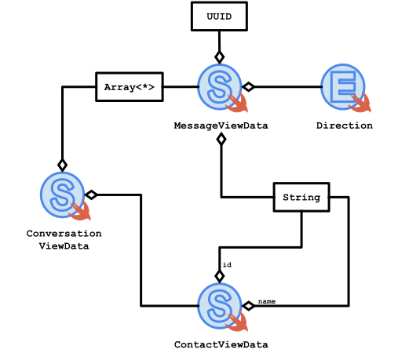
</picture>

### Group `viewmodel` and `view.viewdata`
  View Models serve the `view` with objects made from `view.viewdata` structs, collections, or primitive objects encapsulated by Publishers. This diagram represents all the associations among the artifacts in `viewmodel` and `view.viewdata`.

<picture>
  <source media="(prefers-color-scheme: dark)" srcset="./readme-res/diagrams/dark/viewmodel-viewdata-diagram.dark.svg">
  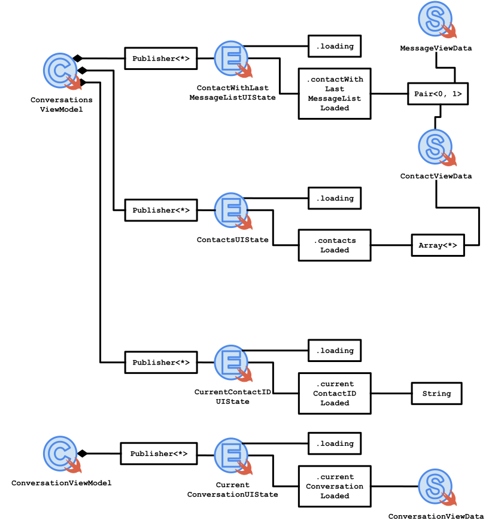
</picture>

### Group `viewmodel` and `model.repository`
  View Models also serve as a [façade](https://en.wikipedia.org/wiki/Facade_pattern), triggering methods in `model.repository` structs. This diagram shows that each View Model has its own repository struct and illustrates all methods each View Model calls, represented by arrows from View Models to Repositories.

<picture>
  <source media="(prefers-color-scheme: dark)" srcset="./readme-res/diagrams/dark/viewmodel-repository-diagram.dark.svg">
  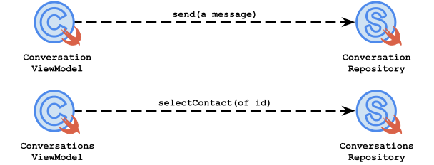
</picture>

### Group `model`
  Model structs handle the logic of the application. This diagram represents all the associations among the structs in the `model`.

<picture>
  <source media="(prefers-color-scheme: dark)" srcset="./readme-res/diagrams/dark/model-diagram.dark.svg">
  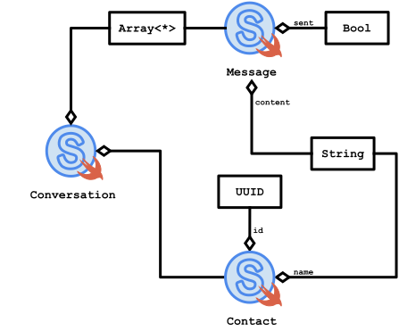
</picture>

### Group `model.repository` and `model`
  These diagrams represent all the associations among the structs in `model.repository` and `model`.

<picture>
  <source media="(prefers-color-scheme: dark)" srcset="./readme-res/diagrams/dark/repository-model-diagram.dark.svg">
  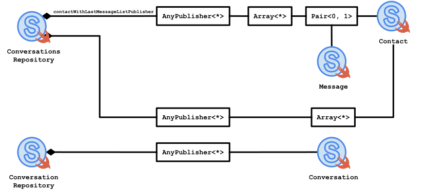
</picture>

## Future Tasks
  - Improve the stability. After some time, the connection between the devices is lost.
  - Use Persistance.
  - Create the app icon.
  - Add more chat features.